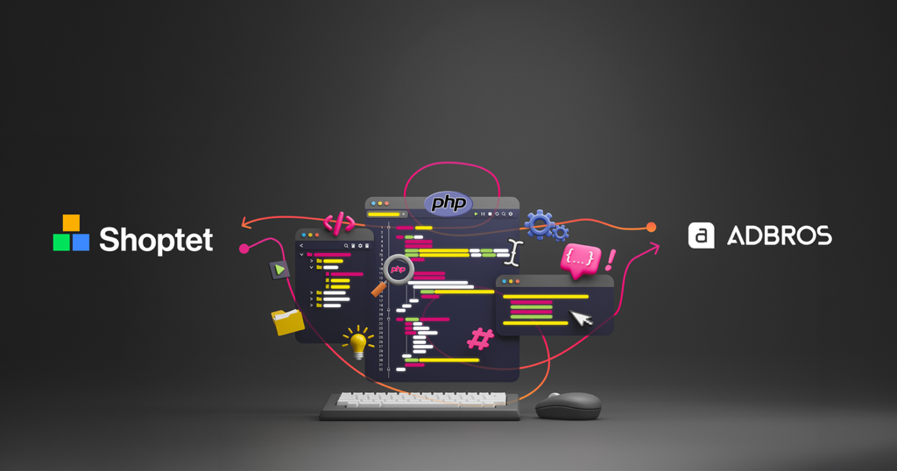

# Shoptet PHP SDK



U nás v Adbrosu máme obrovské zkušenosti s vývojem věrnostního programu na míru. Vzhledem k tomu, že nás oslovil klient s tím, že bych chtěl naše zkušenosti využít ve svém e-shopu postaveném na platformě [Shoptet](https://www.shoptet.cz/) rozhodli jsme se vyvynout univerzální [doplňek](https://doplnky.shoptet.cz/) pro tuto platformu.

K vývoji doplňku je potřeba využít Shoptet API. Jeho [dokumentace](https://shoptet.docs.apiary.io) je na dobré úrovni, bohužel ale neexistuje žádná knihovna pro práci s tímto API pro jazyk PHP, který na backendu našich aplikací primárně používáme. 

Protože je pro nás důležité mít náš kód striktně typovaný, rozhodli jsme se napsat knihovnu vlastní. Jmenuje se [adbros/shoptet-sdk](https://packagist.org/packages/adbros/shoptet-sdk) a je dostupná jako open source pod licencí MIT.

## Získání API tokenu při instalaci doplňku

Pro získání API tokenu je třeba zinicializovat objekt `OAuth`  a tomu předat přístupové údaje k vašemu doplňku.

```php
$oAuth = new Adbros\Shoptet\OAuth(
	clientId: 'clientId',
	clientSecret: 'clientSecret',
	eshopUrl: 'eshopUrl',
);
```

Poté již jen stačí zavolat patřičnou metodu pro získání tokenu.

```php
$oAuthAccessToken = $oAuth->getOAuthAccessToken(
	code: $_GET['code'],
	redirectUri: 'https://example.com/install',
);
```

## Použití SDK

Knihovnu je nejprve nutné inicializovat pomocí API tokenu, který jsme získali během instalace doplňku v předchozím kroku.

```php
$sdk = new Adbros\Shoptet\Sdk(
	apiAccessToken: $apiAccessToken->accessToken,
);
```

Poté již můžeme získat například seznam všech uživatelů s detailními informacemi o nich.

```php
$page = 1;

do {
	$customers = $sdk->getCustomers(
        page: $page,
    );
	
	foreach ($customers->customers as $customer) {
		$customerDetail = $sdk->getCustomer(
            guid: $customer->guid,
        );
	}
} while ($page++ < $customers->paginator->pageCount);
```

Nebo si zaregistrovat webhooky.

```php
$sdk->createWebhook(
    event: [
        Adbros\Shoptet\Enum\Event::OrderCreate,
        Adbros\Shoptet\Enum\Event::CustomerCreate,
    ],
    url: 'https://example.com/webhook',
);
```

## Dostupné API endpointy

Knihovna momentálně nepokrývá všechny API endpointy, které Shoptet API poskytuje. Zapracované jsou ty, které jsme potřebovali pro náš doplněk.

- getCustomers
- getCustomer
- getWebhooks
- createWebhook
- deleteWebhook
- createDiscountCoupons
- createDiscountCouponsSet
- getDiscountCouponTemplates
- getOrder
- getOrders
- getEshopInfo

Pokud vás knihovna zaujala a něco vám v ní chybí, vytvořte [issue](https://github.com/adbrosaci/shoptet-sdk/issues) nebo ještě lépe vytvořte [pull request](https://github.com/adbrosaci/shoptet-sdk/pulls), rádi se na váš požadavek podíváme nebo váš návrh na změnu přijmeme.
